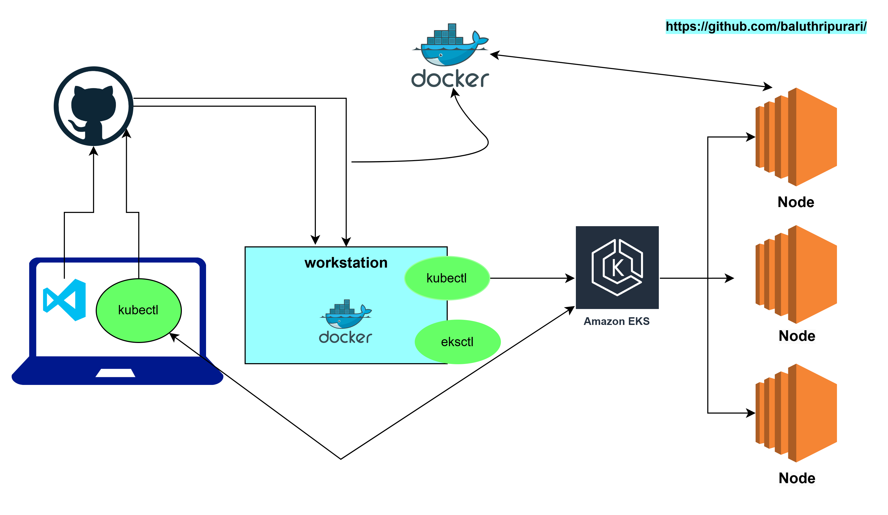

## Kubernetes
* eksctl ---> AWS CLI tool for managing EKS clusters
* kubectl ---> CLI tool for managing Kubernetes clusters

- kubectl client --version 
- kubectl cluster-info
- eksctl version
- eksctl get cluster --name <cluster-name
- eksctl delete cluster --name <cluster-name> --region <region-name> --force

- kubectl get nodes ---> Get a list of all nodes in the cluster
- kubectl get pods  ---> Get a list of all pods in the cluster
- kubectl get deployments ---> Get a list of all deployments in the cluster
- kubectl get svc ---> Get a list of all services in the cluster
- kubectl get ingress ---> Get a list of all ingress resources in the cluster
- kubectl get configmap ---> Get a list of all configmaps in the cluster
- kubectl get secret ---> Get a list of all secrets in the cluster
- kubectl get persistentvolume ---> Get a list of all persistent volumes in the cluster
- kubectl get persistentvolumeclaim ---> Get a list of all persistent volume claims in the cluster
- kubectl get storageclass ---> Get a list of all storage classes in the cluster
- kubectl get clusterrole ---> Get a list of all cluster roles in the cluster
- kubectl get clusterrolebinding ---> Get a list of all cluster role bindings in the cluster
- kubectl get role ---> Get a list of all roles in the cluster
- kubectl get rolebinding ---> Get a list of all role bindings in the cluster
- kubectl get serviceaccount ---> Get a list of all service accounts in the cluster
- kubectl get podtemplate ---> Get a list of all pod templates in the cluster
- kubectl get poddisruptionbudget ---> Get a list of all pod disruption budgets in the cluster
- kubectl get podsecuritypolicy ---> Get a list of all pod security policies in the cluster

## K8 Resources
Namespace --> Isolated project where you can create resources related to your application

